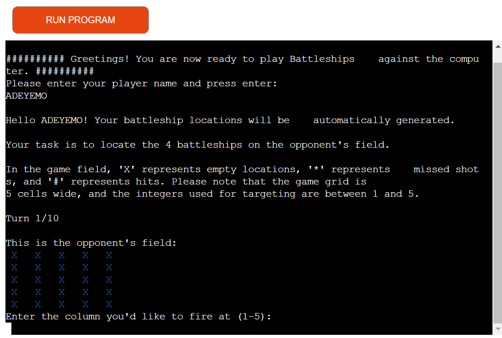
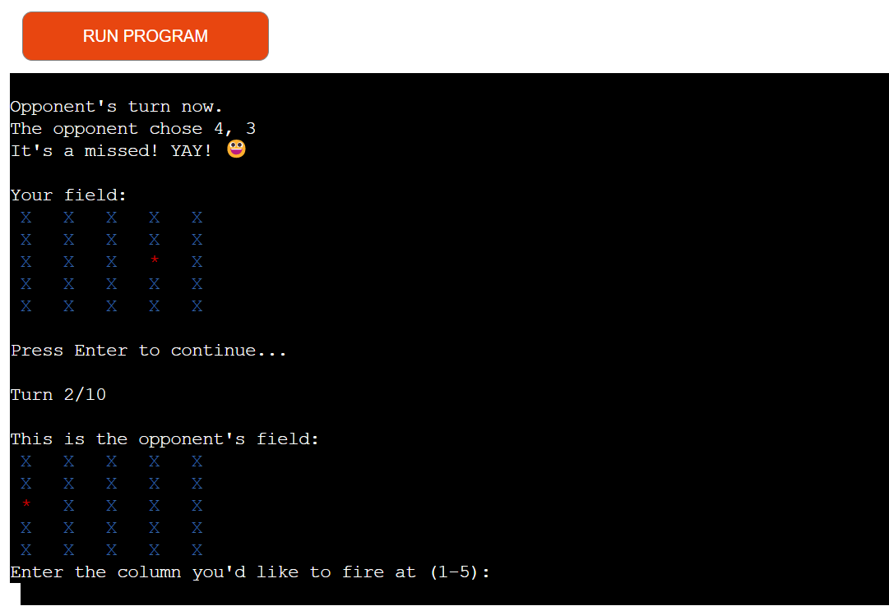
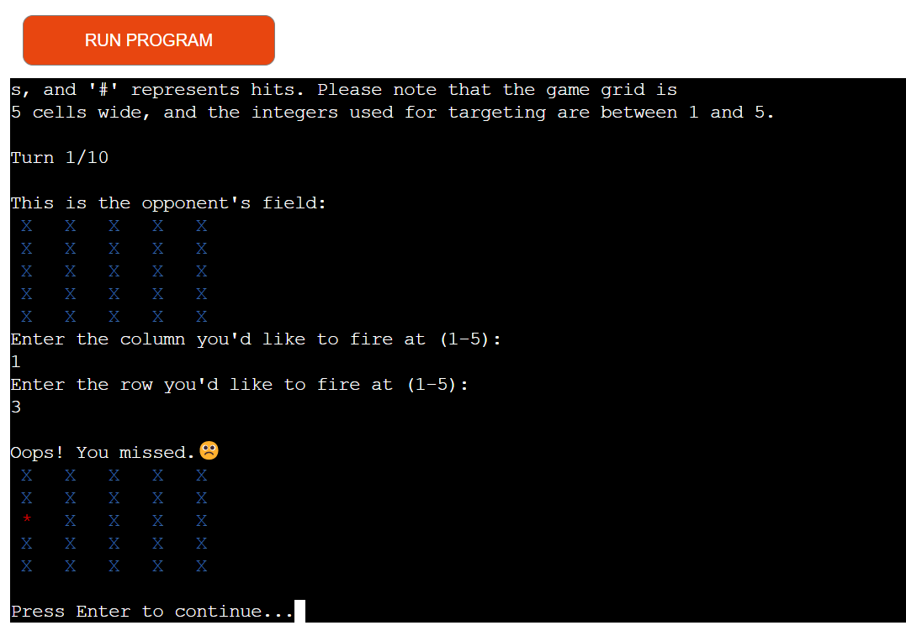
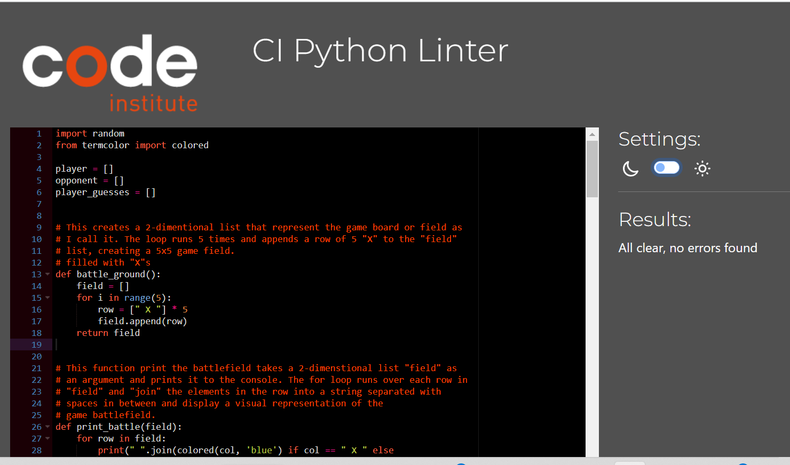
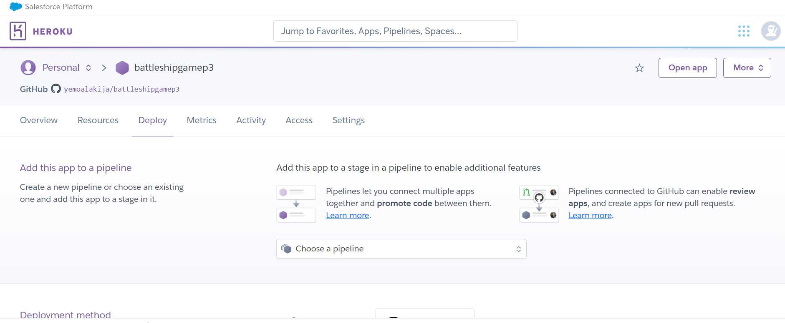
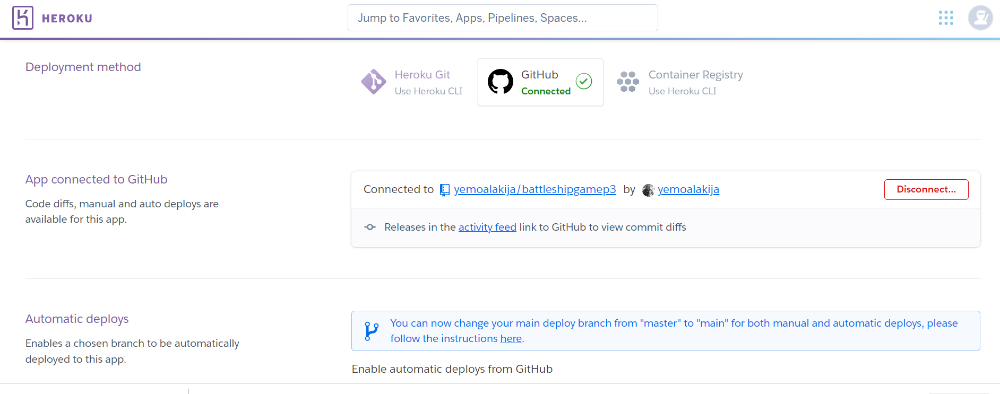
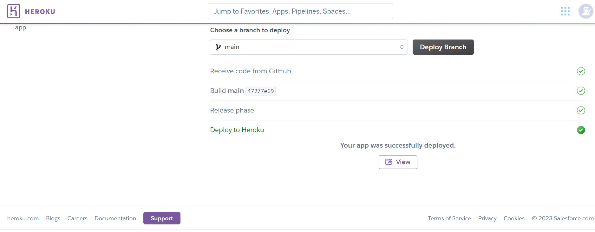

# TABLE OF CONTENT

1. <a href= "#about-this-website">ABOUT THIS WEBSITE</a>

2. <a href= "#how-to-play">HOW-TO-PLAY</a>

3. <a href= "#user-experience-ux">USER EXPERIENCE (UX)</a>

    - <a href= "#user-stories">User Stories</a>

    - <a href= "#design">Design</a>

4. <a href= "#features">FEATURES</a>

    <a href= "#future-features">Future Features</a>

5. <a href ="#testing">TESTING</a>

    - <a href ="#validator-testing">PEP8 Validator Testing</a> 

    - <a href ="#browser-compatibility">Browser Compatibility</a>

    - <a href ="#fixed-bugs">Fixed Bugs</a>

6. <a href= "#technologies-used">TECHNOLOGIES USED></a>

7. <a href= "#deployment">DEPLOYMENT</a>

    - <a href= "#how-to-create-a-local-clone-of-this-project">How to create a local clone of this project</a>

8. <a href= "#credit">CREDIT</a>

9. <a href= "#acknowledgement">ACKNOWLEDGEMENT</a> 

---

# BATTLESHIP GAME P3

## ABOUT THIS WEBSITE

Battleship Game P3 is a classic two-player strategy game where each player has a fleet of ships and they take turns guessing the coordinates to try and sink their opponent's ships. The objective of the game is to sink all of your opponent's ships before they sink all of yours. The game is played on a grid where each player secretly places their ships. The players then take turns guessing the coordinates of the other player's ships, marking a hit or a miss on their own grid. The first player to sink all of their opponent's ships wins the game.

Here is the link to the website: [BattleShip Game P3](https://battleshipgamep3.herokuapp.com/)

## HOW TO PLAY

-The aim of the game is to sink the enemy battleship that is hidden, by guessing row and column coordinates each turn. 

- Player inputs his or her name and the game starts.

- In this Battleship Game, there is a single ship hidden in a random location on a 5x5 grid. 
- The player will have 10 guesses to try to sink the ship

- The columns are numbers (1, 2, 3, 4, 5) and rows are numbers (1, 2, 3, 4, 5). 

- The player can click on the red button at the top left-hand corner named "RUN PROGRAM" to refresh or restart the game at anytime. 

## USER EXPERIENCE (UX)

### User Stories 

- As a user I want to be able to play the battleship game.
- As a user I want to be able to clone this game. 

### Design 

Termcolor was installed in gitpod application for this game to enhance user experience. 

See below game structure and layout:

## FEATURES

There is a system in place that prevents the player from attacking their own ship, selecting an already entered coordinate either by the player or enemy or selecting an invalid number. 

The computer is also prevented from selecting an invalid or already entered coordinate. In the event the player sinks the enemy ship first, they win, and the game tells the user how many attempts it took for the player to win. If the enemy wins then the game tells you how many attempts it took the computer to win. 

### Future Features

Additional features in the near future shall include more colunms, rows and attempts to make users play time duration longer. 

## TESTING

This website was tested using CI Python Linter Validator by Code Institute 

### Validator Testing 

- PEP8 Validator 
There were no errors found as seen here: 

### Responsiveness Test

The responsive design tests were carried out manually with [Google Chrome DevTools](https://developer.chrome.com/docs/devtools/) and [Responsive Design Checker](https://www.responsivedesignchecker.com/). 
The following devices were all tested and passed: Desktop 15-24", Galaxy S5-S7, Galaxy A, iPhone 3-7, Sony Z2-Z3, iPad and iPad Mini

### Browser Compatibility

The Game was succcesfully tested on the following browsers and there no errors found. Google Chrome, Microsoft Edge and Mozilla Firefox. Responsiveness were consistent on all above mentioned browsers and devices.

### Fixed Bugs

No bugs found  

## TECHNOLOGIES USED

- HTML5 - provides the structure and content for the website.
- Gitpod - workspaces used for creating game in run.py file.
- Github - used for hosting and editing the website.
- Heroku - used for deployment of the game 

## DEPLOYMENT

The Game was deployed on Heroku. The steps to deploy are as follows:

- Clone this repository 

- Create a new Heroku app

 - Add Config Vars and buildpacks heroku/python and heroku/nodejs in Heroku settings:

- In the "deploy" section, connect Github to Heroku and then Game deployed.

Here is the live link: - [BattleShip Game P3](https://yemoalakija.github.io/battleshipgamep3/)

This Game is deployed on Heroku and therefore the live link on Github opens the README information. 

### How to create a local clone of this project

Acces Github and follow below instructions:

- STEP 1 - Click on the code tab, under repository name. 
- STEP 2 - Click on the clipboard icon to copy URL. 
- STEP 3 - Open Git Bash in your chosen IDE. 
- STEP 4 - Change clone directory location.
- STEP 5 - Type git clone, and then paste the URL copied from GitHub.

## CREDIT

- [I Am Responsive](https://amiresponsive.co.uk/) - Used for media screens 
- [CI Python Linter](https://pep8ci.herokuapp.com/) - Used for python validator 
- [Heroku](https://heroku.com) - Used to deploy Battleship Game.

## ACKNOWLEDGEMENT 

This website was completed in accordance with the criteria for Portfolio 3 Project of The Full Stack Software Developer Diploma at the Code Institute. 